# Pipeline Strategy

This document explains our CI/CD approach for Power Platform solutions using GitHub Actions and PAC CLI.

---

## Why PAC CLI Over Alternatives

We use PAC CLI directly instead of `microsoft/powerplatform-actions` or Power Platform Pipelines.

| Approach | Pros | Cons | Our Choice |
|----------|------|------|------------|
| **PAC CLI** | Portable, reliable, full control | More setup | ✅ Selected |
| **powerplatform-actions** | Less code | Download issues, less portable | ❌ Not used |
| **Power Platform Pipelines** | Built-in, simple | No source control | ❌ Not used |

**Rationale:**

1. **Reliability** - PAC CLI installs from NuGet, avoiding GitHub action download issues
2. **Portability** - Same commands work in Azure DevOps with minimal changes
3. **Transparency** - Direct commands are easier to debug than wrapped actions
4. **Extensibility** - Full control over validation, error handling, and custom logic

---

## Pipeline Architecture

```mermaid
graph TB
    subgraph "Export Pipeline"
        E1[Checkout]
        E2[Install PAC CLI]
        E3[Authenticate to Dev]
        E4[Export Unmanaged]
        E5[Export Managed]
        E6[Unpack Both]
        E7[Commit to develop]
    end

    subgraph "Deploy Pipeline"
        D1[Checkout]
        D2[Install PAC CLI]
        D3[Authenticate to Target]
        D4[Pack Managed]
        D5[Import Solution]
    end

    E1 --> E2 --> E3 --> E4 --> E5 --> E6 --> E7
    D1 --> D2 --> D3 --> D4 --> D5
```



---

## Workflow Files

### Current Implementation

| Workflow | Trigger | Purpose |
|----------|---------|---------|
| `export-solution.yml` | Nightly, manual | Export from Dev → deploy to QA |

### Planned Workflows

| Workflow | Trigger | Purpose |
|----------|---------|---------|
| `deploy-to-prod.yml` | Push to `main` | Deploy to Production |
| `validate-pr.yml` | PR to `develop` | Validate solution can be imported |

---

## Pipeline Components

### PAC CLI Installation

```yaml
- name: Setup .NET
  uses: actions/setup-dotnet@v4
  with:
    dotnet-version: '8.x'

- name: Install Power Platform CLI
  run: |
    dotnet tool install --global Microsoft.PowerApps.CLI.Tool
    echo "$HOME/.dotnet/tools" >> $GITHUB_PATH
```

### Authentication

```yaml
- name: Authenticate to environment
  run: |
    pac auth create \
      --environment "${{ vars.POWERPLATFORM_ENVIRONMENT_URL }}" \
      --tenant "${{ vars.POWERPLATFORM_TENANT_ID }}" \
      --applicationId "${{ vars.POWERPLATFORM_CLIENT_ID }}" \
      --clientSecret "${{ secrets.POWERPLATFORM_CLIENT_SECRET }}"
```

### Export Operations

```yaml
# Export both managed and unmanaged
- name: Export Solution (Unmanaged)
  run: |
    pac solution export \
      --name "${{ env.SOLUTION_NAME }}" \
      --path "./exports/${{ env.SOLUTION_NAME }}_unmanaged.zip" \
      --managed false

- name: Export Solution (Managed)
  run: |
    pac solution export \
      --name "${{ env.SOLUTION_NAME }}" \
      --path "./exports/${{ env.SOLUTION_NAME }}_managed.zip" \
      --managed true
```

### Unpack Operations

```yaml
- name: Unpack Solution (Unmanaged)
  run: |
    pac solution unpack \
      --zipfile "./exports/${{ env.SOLUTION_NAME }}_unmanaged.zip" \
      --folder "./solutions/${{ env.SOLUTION_NAME }}/src/Unmanaged" \
      --processCanvasApps

- name: Unpack Solution (Managed)
  run: |
    pac solution unpack \
      --zipfile "./exports/${{ env.SOLUTION_NAME }}_managed.zip" \
      --folder "./solutions/${{ env.SOLUTION_NAME }}/src/Managed" \
      --packagetype Managed
```

### Pack and Import Operations

```yaml
- name: Pack Solution (Managed)
  run: |
    pac solution pack \
      --zipfile "./exports/${{ env.SOLUTION_NAME }}_managed.zip" \
      --folder "./solutions/${{ env.SOLUTION_NAME }}/src/Managed" \
      --packagetype Managed

- name: Import Solution
  run: |
    pac solution import \
      --path "./exports/${{ env.SOLUTION_NAME }}_managed.zip" \
      --force-overwrite \
      --publish-changes
```

---

## Environment Configuration

### GitHub Environments

Each Power Platform environment maps to a GitHub environment:

```
GitHub Environment: Dev
├── Variables:
│   ├── POWERPLATFORM_ENVIRONMENT_URL
│   ├── POWERPLATFORM_TENANT_ID
│   └── POWERPLATFORM_CLIENT_ID
└── Secrets:
    └── POWERPLATFORM_CLIENT_SECRET
```

### Variable Naming

| Variable | Description | Example |
|----------|-------------|---------|
| `POWERPLATFORM_ENVIRONMENT_URL` | Dataverse URL | `https://org.crm.dynamics.com/` |
| `POWERPLATFORM_TENANT_ID` | Azure AD tenant | `xxxxxxxx-xxxx-xxxx-xxxx-xxxxxxxxxxxx` |
| `POWERPLATFORM_CLIENT_ID` | Service principal app ID | `xxxxxxxx-xxxx-xxxx-xxxx-xxxxxxxxxxxx` |
| `POWERPLATFORM_CLIENT_SECRET` | Service principal secret | (stored as secret) |

---

## Extensibility Points

### Adding Solution Validation

```yaml
- name: Run Solution Checker
  run: |
    pac solution check \
      --path "./exports/${{ env.SOLUTION_NAME }}.zip" \
      --outputDirectory "./reports"
```

### Adding Custom Pre-Deployment Validation

```yaml
- name: Validate solution structure
  run: |
    # Custom validation script
    ./scripts/validate-solution.ps1 -Path "./solutions/${{ env.SOLUTION_NAME }}"
```

### Adding Multi-Solution Support

For solutions with dependencies, deploy in order:

```yaml
jobs:
  deploy-base:
    # Deploy base solution first

  deploy-dependent:
    needs: deploy-base
    # Deploy dependent solution after base succeeds
```

---

## Error Handling

### Retry Logic

```yaml
- name: Import Solution with Retry
  uses: nick-fields/retry@v2
  with:
    timeout_minutes: 30
    max_attempts: 3
    command: |
      pac solution import \
        --path "./exports/${{ env.SOLUTION_NAME }}_managed.zip" \
        --force-overwrite
```

### Failure Notifications

```yaml
- name: Notify on Failure
  if: failure()
  run: |
    # Send notification (Teams, Slack, email, etc.)
    echo "Deployment failed for ${{ env.SOLUTION_NAME }}"
```

---

## Migration to Azure DevOps

The PAC CLI commands are identical in Azure DevOps. Only the pipeline syntax changes:

**GitHub Actions:**
```yaml
- name: Export Solution
  run: pac solution export --name "MySolution" --path "./solution.zip"
```

**Azure DevOps:**
```yaml
- script: pac solution export --name "MySolution" --path "./solution.zip"
  displayName: 'Export Solution'
```

For authentication, Azure DevOps uses the Power Platform Build Tools extension or service connections instead of direct PAC CLI auth.

---

## Future Enhancements

| Enhancement | Description | Priority |
|-------------|-------------|----------|
| Solution Checker integration | Automated quality gates | High |
| PR validation pipeline | Test import before merge | High |
| Multi-solution templates | Reusable pipeline templates | Medium |
| Approval gates | Manual approval for production | Medium |
| Rollback automation | Quick rollback on failure | Low |

---

## 🔗 See Also

- [ALM_OVERVIEW.md](ALM_OVERVIEW.md) - High-level ALM philosophy
- [ENVIRONMENT_STRATEGY.md](ENVIRONMENT_STRATEGY.md) - Environment configuration
- [BRANCHING_STRATEGY.md](BRANCHING_STRATEGY.md) - Git workflow
- [PAC CLI Reference](https://learn.microsoft.com/en-us/power-platform/developer/cli/reference/) - Official documentation
